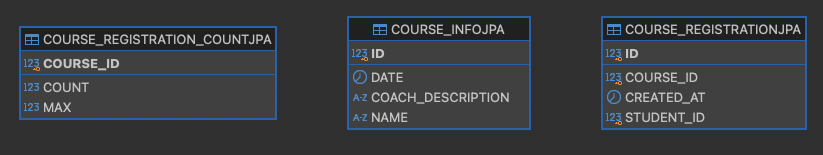

# ERD


_그림에는 foreign key가 포함되지 않음_

## 테이블(코스==특강)
### 코스 정보 테이블 (course_infojpa)
- 코스와 관련된 기본 정보를 저장하기 위한 테이블
- 과제 구현을 위해 강사 정보를 string으로 포함했으나, 추후 별도 테이블로 분리하는 것이 좋을 듯

### 코스 등록 인원 테이블 (course_registration_countjpa)
- 각 코스에 등록된 학생 수를 관리하는 테이블
- 해당 코스에 등록된 현재 인원(count)과 최대 수용 가능 인원(max)을 저장
- 현재 인원이 수용 가능 인원을 초과하지 않게끔 비즈니스 로직 설계
- course_infojpa 테이블과 분리한 이유는 처리량을 높이기 위해서
  - 만약 해당 정보가 코스 정보 테이블에 포함되어 있었다면, 코스 정보를 보기 위한 요청에도 락에 영향을 받았을 것입니다.
  - 따라서 코스 정보 조회와 코스 신청 락을 별개로 가져가기 위하여 테이블을 분리했습니다.
  - 대안으로는, 신청자 수를 매번 course registration 테이블을 조회하여 가져오는 방법이 있습니다.
  - 하지만 이것 역시 쿼리 시간을 많이 잡아먹을 것이므로 이용하지 않았습니다.
  - DB 최적화를 통해 이를 해결할 방법이 있을 수도 있기에 더 검색해볼 예정입니다.
  - 비관적 락을 사용하기 때문에 제가 이용한 기법의 효과가 클 것이라고 생각합니다.

### 코스 등록 테이블 (course_registrationjpa)
- 학생들의 코스 등록 정보를 관리하는 테이블
- 등록된 코스 ID (course_id), 등록 시간(created_at), 학생 ID (student_id)를 통해 누가 어떤 것을 신청했는지 저장
- 정규화를 통해 course_infojpa 테이블과 분리함

### JOIN문
JPA의 N+1 문제 발생을 억제시키고, 성능 향상을 위해 JPQL을 이용하여 Join문을 통해 아래의 두 정보 조회를 해결했습니다.
- 특정 날짜의 수강신청 자리가 남은 강의의 정보를 모두 가져오기(course info & course registration count)
- 특정 학생이 수강신청한 모든 코스의 정보와 수강신청 시간을 모두 가져오기(course info & course registration)

### DDL
```sql
CREATE TABLE course_infojpa (
    id BIGINT NOT NULL PRIMARY KEY,
    date DATE,
    coach_description VARCHAR(255),
    name VARCHAR(255)
);

CREATE TABLE course_registration_countjpa (
    course_id BIGINT NOT NULL PRIMARY KEY,
    count INTEGER,
    max INTEGER,
);

CREATE TABLE course_registrationjpa (
    id BIGINT NOT NULL PRIMARY KEY,
    course_id BIGINT,
    student_id BIGINT,
    created_at TIMESTAMP(6),
    CONSTRAINT OneStudentPerCourse UNIQUE (course_id, student_id)
);

alter table course_registration_countjpa
    add foreign key (course_id)
    references course_infojpa

alter table course_registrationjpa
    add foreign key (course_id)
        references course_infojpa
```

## JPA 관련
아직은 JPA에 익숙하지 않아, Foreign Key와 관련된 설정을 하지 못했다.
향후 이 부분을 보완하면 좋을 것 같음
