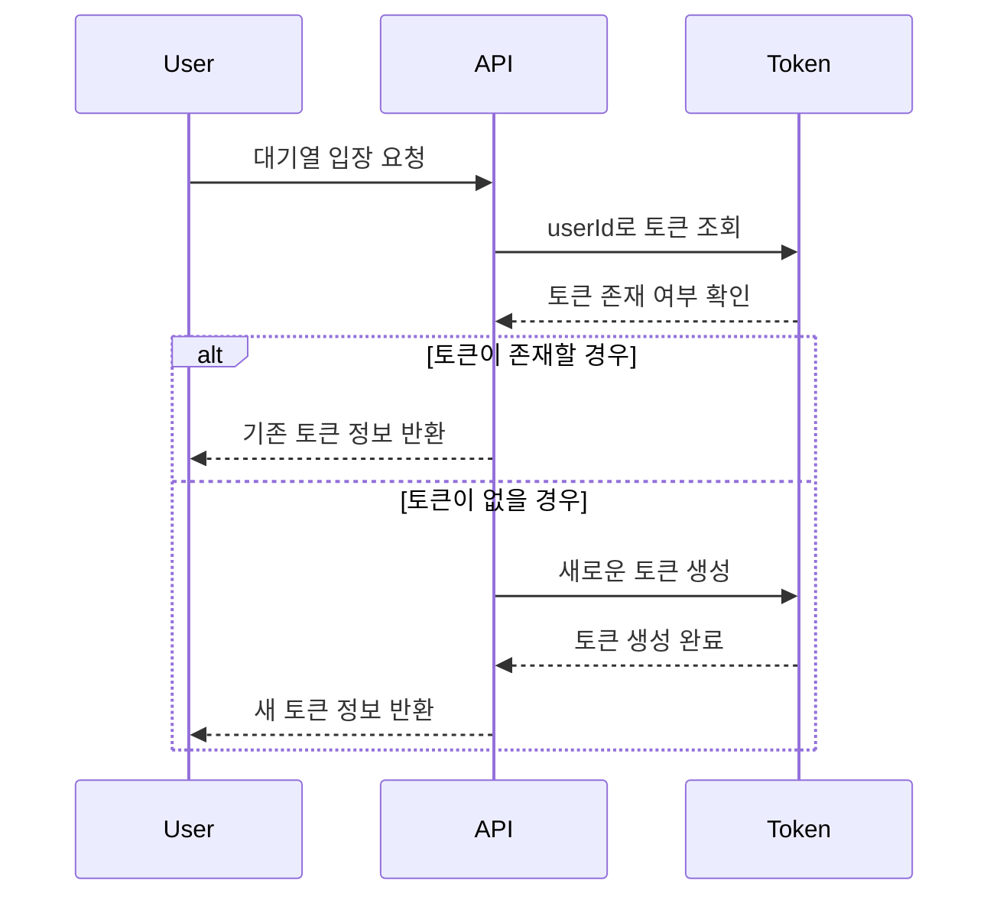
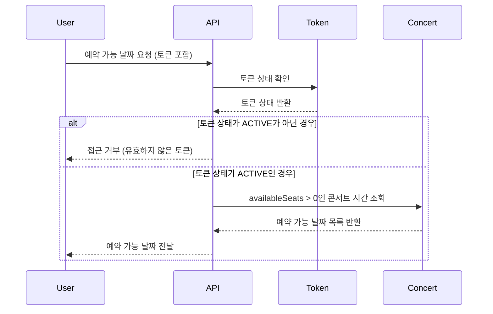
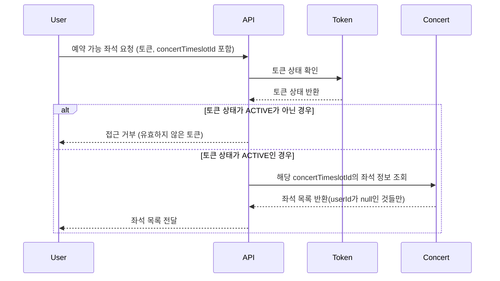
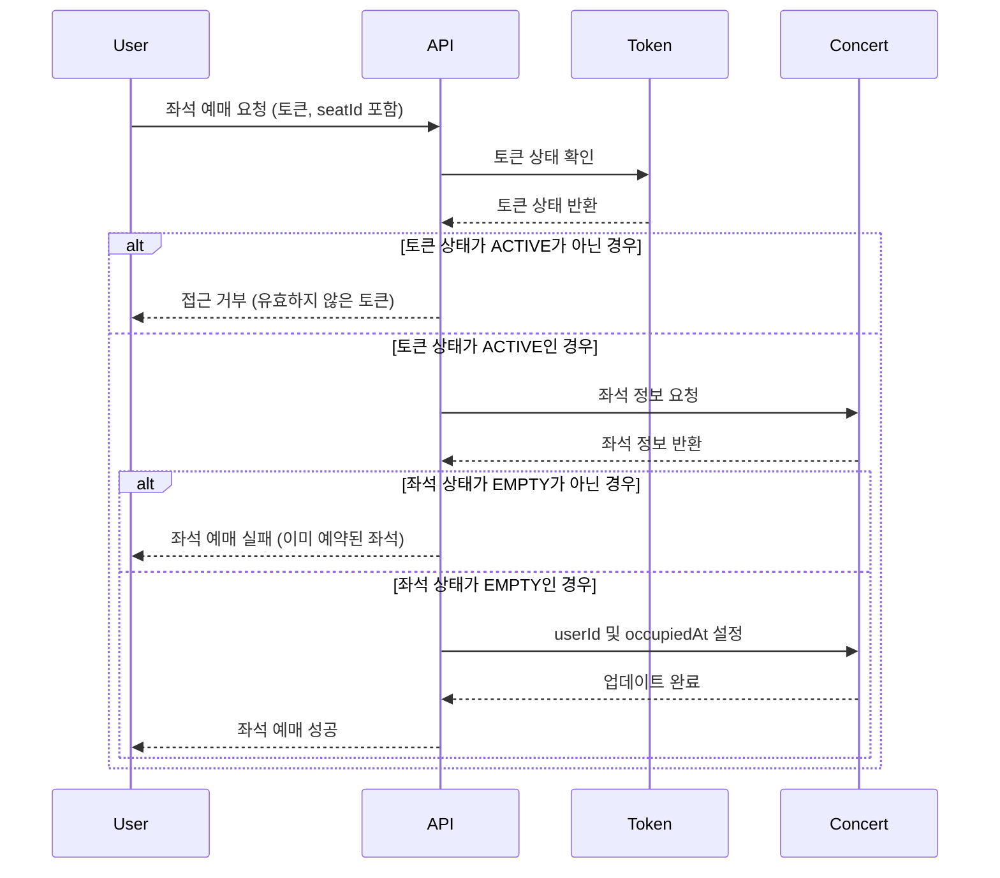
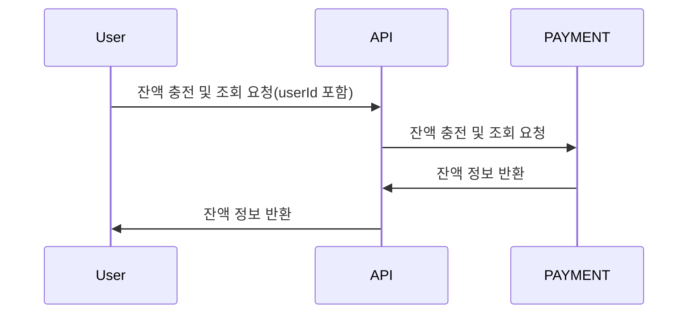
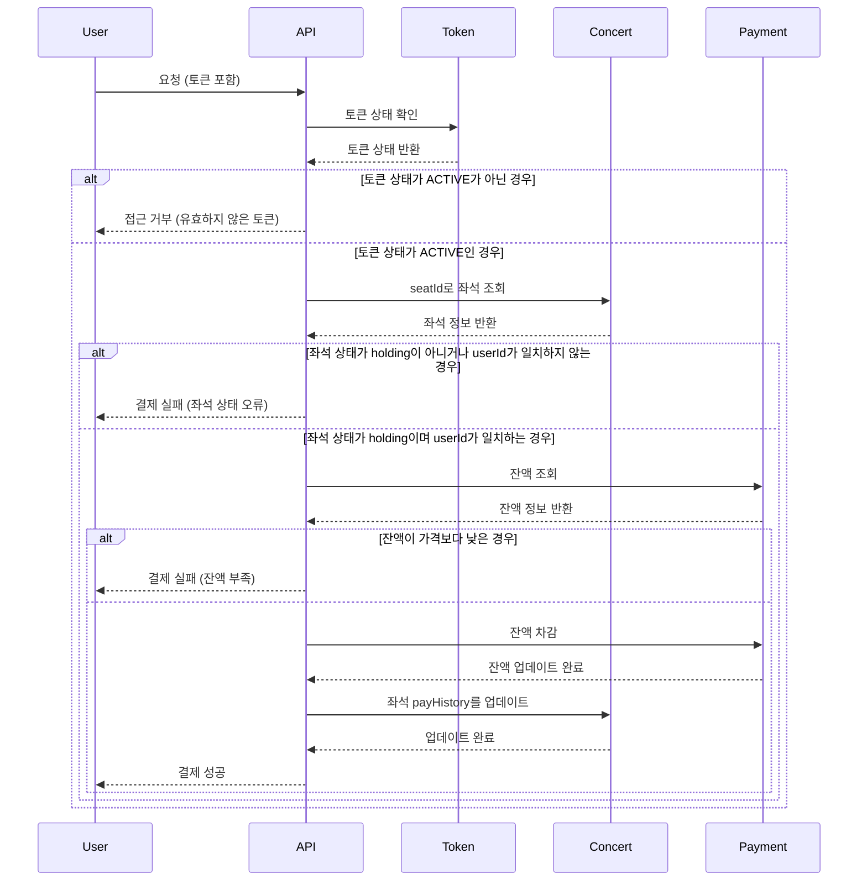
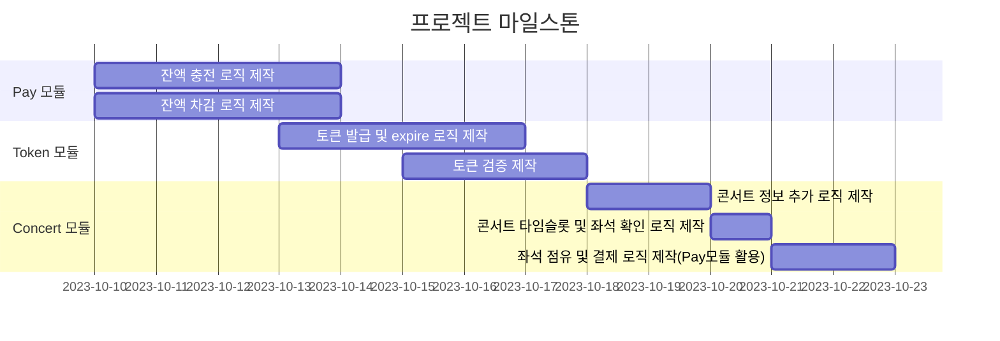
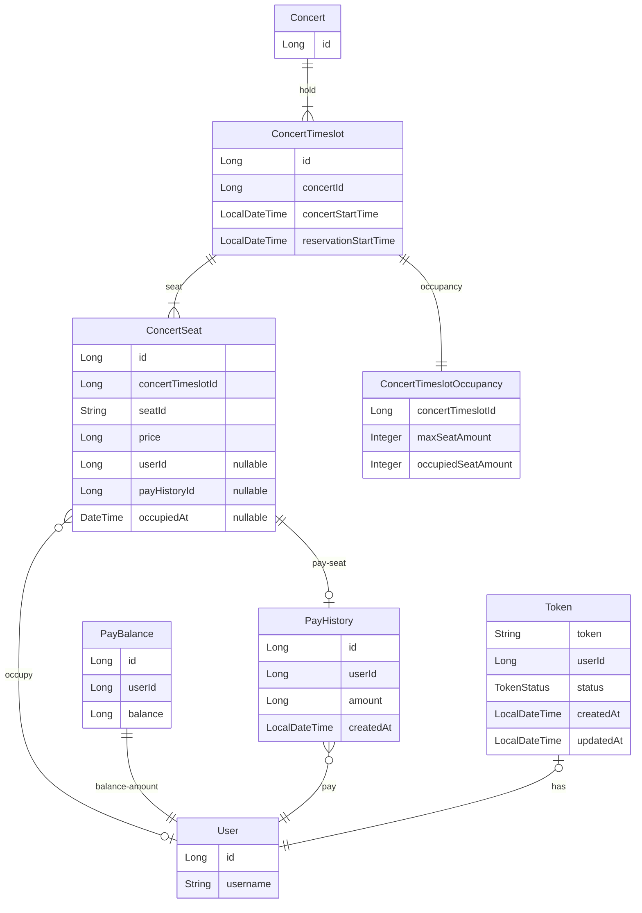
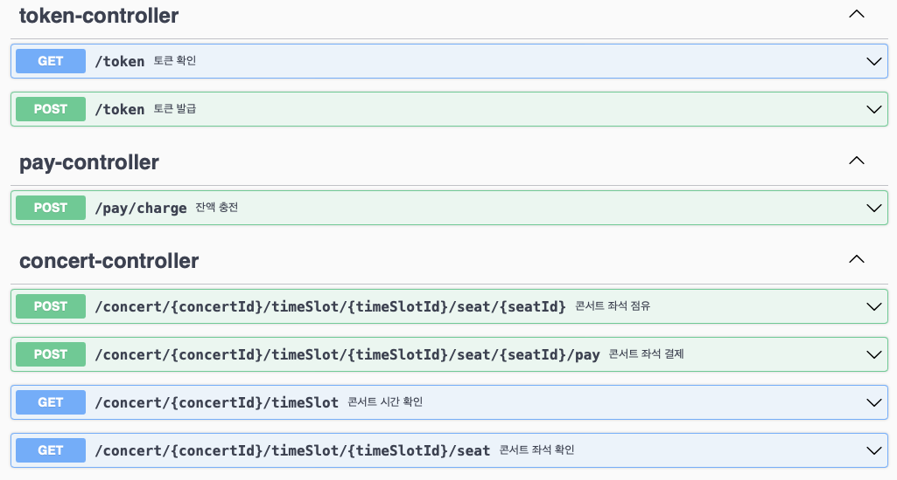

# 요구사항 분석
## 요지
콘서트 예약 시스템
- 여러 콘서트를 대상으로 예매 시스템을 구축하기 위한 구조 설계
- 다량의 트래픽 증가를 염두에 두고 대기열 시스템을 통해 접속량 통제

## 목차
- [요구사항 분석 및 시퀀스 다이어그램](#요구사항-분석-및-시퀀스-다이어그램)
- [플로우차트](#플로우차트)
- [마일스톤](#마일스톤)
- [ERD](#ERD)
- [API 명세](#API-명세)

## 요구사항 분석 및 시퀀스 다이어그램
### 대기열
아래의 기능에 접근하기 위한 토큰을 발급한다.

1. 토큰 테이블 필요 : id, userId, status(WAIT, ACTIVE, EXPIRED), createdAt(토큰 발급 시간), updatedAt(토큰 status가 update된 시간)
2. if `userId에 해당하는 토큰이 존재` -> 존재하는 토큰 정보를 리턴
3. if `userId에 해당하는 토큰이 없음` -> 토큰을 생성하여 리턴

### 예약 가능 날짜
1. 대기열 토큰 검증(if `토큰의 status가 ACTIVE가 아님` -> 거부, else -> 다음 단계)
2. 콘서트 시간(날짜) 테이블 필요 : id, concertId, concertStartTime, reservationStartTime
3. 콘서트 id에 해당하는 시간 중 잔여석 갯수가 0 이상인 것만 리턴 

### 예약 가능 좌석
1. 대기열 토큰 검증(if `토큰의 status가 ACTIVE가 아님` -> 거부, else -> 다음 단계)
2. 콘서트 좌석 예매 테이블 필요 : id, concertTimeId, seatId, price, userId, payHistoryId, occupiedAt
   1. unique index 필요 : concertTimeId와 seatId 
3. 콘서트 좌석 예매 테이블 중, concertTimeId에 해당하면서 userId가 null인 것들을 모두 리턴

### 좌석 예매
1. 대기열 토큰 검증(if `토큰의 status가 ACTIVE가 아님` -> 거부, else -> 다음 단계)
2. 콘서트 좌석 예매 테이블
    1. 동시성 제어 필요 : 비관적 락
3. if `id에 해당하는 row의 status가 empty이면` -> userId를 설정하고, occupiedAt을 현재 시간으로 설정

### 잔액 충전 / 조회
1. 잔액 테이블 필요 : id, userId, amount
2. 잔액 충전 및 조회

### 결제
1. 대기열 토큰 검증(if `토큰의 status가 ACTIVE가 아님` -> 거부, else -> 다음 단계)
2. 콘서트 좌석의 status가 holding임을 확인
3. 잔액이 콘서트 좌석의 price보다 높음을 확인
4. 잔액을 콘서트 좌석의 price만큼 차감
5. 콘서트 좌석의 status를 paid로 변경

## 플로우차트

## 마일스톤
최종 기간 : 3주차~5주차

모든 기능의 완성에는 테스트까지를 포함

특이사항 : 취준 일정(코테등..) 겹쳐있어 주말은 최대한 제외

- Pay 모듈
  - 10/14까지 잔액 충전 로직 제작
  - 10/14까지 잔액 차감 로직 제작
- Token 모듈
  - 10/17까지 토큰 발급 및 expire 로직 제작
  - 10/18까지 토큰 검증 제작
  - 다량 트래픽 대응 고려
- Concert 모듈
  - 10/21까지 콘서트 정보 추가 로직 제작
  - 10/22까지 콘서트 타임슬롯 및 좌석 확인 로직 제작
  - 10/23까지 좌석 점유 및 결제 로직 제작(Pay모듈 활용) 

## ERD

- Foreign Key에 관하여
  - Database의 정규화와 데이터 보호 등을 위해서는 Foreign Key를 설정해야 한다.
  - 하지만 현실적으로는 DB Lock에 의한 Foreign key의 연쇄 lock 등으로 인해 DB 성능이 급격히 감소한다.
  - 따라서 논리적 Foreign Key만을 설정하고, 실제 DB에는 Foreign Key와 JPA mapping을 설정하지 않았다.
- ConcertSeat에 관하여
  - ConcertSeat Table에는 userId, payHistoryId, occupiedAt이 존재한다.
  - seat를 점유했을 시, userId와 occupiedAt의 값을 채워넣는다
  - seat를 결제할 시, 결제 정보를 payHistoryId에 채워넣는다
  - 결제 없이 점유가 해제되었을 경우, userId와 occupiedAt을 null로 채워넣는다.
  - 이를 통해 유저가 보유한 여러 payHistory중, 어떤 것이 어떤 자리를 위한 결제 내역인지 파악할 수 있다.

## API 명세
Swagger를 이용하여 API 명세를 문서화하였습니다.

[Swagger Full API List pdf](docs/swagger.pdf)
