# 요구사항 분석
## 요지
콘서트 예약 시스템
- 여러 콘서트를 대상으로 예매 시스템을 구축하기 위한 구조 설계
- 다량의 트래픽 증가를 염두에 두고 대기열 시스템을 통해 접속량 통제

## 필요기능
### 대기열
아래의 기능에 접근하기 위한 토큰을 발급한다.

1. 토큰 테이블 필요 : id, userId, status(hold, pass, expired), createdAt(토큰 발급 시간), updatedAt(토큰 status가 update된 시간)
2. if `userId에 해당하는 토큰이 존재` -> 이미 있는 토큰을 리턴
3. if `userId에 해당하는 토큰이 없음` -> 토큰을 생성하여 리턴

### 예약 가능 날짜
1. 대기열 토큰 검증(if `토큰의 status가 pass` -> 다음단계, else -> 거부)
2. 콘서트 시간(날짜) 테이블 필요 : id, concertId, concertTime, reservationStartTime, availableSeats
3. 콘서트 id에 해당하는 시간 중 잔여석 갯수가 0 이상인 것만 리턴 

### 예약 가능 좌석
1. 대기열 토큰 검증(if `토큰의 status가 pass` -> 다음단계, else -> 거부)
2. 콘서트 좌석 예매 테이블 필요 : id, concertTimeId, seatId, price, userId, status(empty, holding, paid)
   1. unique index 필요 : concertTimeId와 seatId 
3. 콘서트 좌석 예매 테이블 중, concertTimeId에 해당하면서 status가 empty인 것들을 모두 리턴

### 좌석 예매
1. 대기열 토큰 검증(if `토큰의 status가 pass` -> 다음단계, else -> 거부)
2. 콘서트 좌석 예매 테이블
    1. 동시성 제어 필요 : 비관적 락
3. if `id에 해당하는 row의 status가 empty이면` -> userId를 설정하고, status를 holding으로 변경

### 잔액 충전 / 조회
1. 대기열 토큰 검증(if `토큰의 status가 pass` -> 다음단계, else -> 거부)
2. 잔액 테이블 필요 : id, userId, amount
3. 잔액 충전 및 조회

### 결제
1. 대기열 토큰 검증(if `토큰의 status가 pass` -> 다음단계, else -> 거부)
2. 콘서트 좌석의 status가 holding임을 확인
3. 잔액이 콘서트 좌석의 price보다 높음을 확인
4. 잔액을 콘서트 좌석의 price만큼 차감
5. 콘서트 좌석의 status를 paid로 변경

# Sequence Diagram
위의 요구사항을 바탕으로 작성된 시나리오 기반 Sequence Diagram

```mermaid
sequenceDiagram
  participant User as User
  participant System as System
  participant TokenDB as Token Table
  participant ConcertTimeDB as Concert Time Table
  participant SeatDB as Seat Reservation Table
  participant BalanceDB as Balance Table

  rect rgb(255,255,255)
    Note right of User: Token 발급
    User ->> System: 대기열 입장 요청
    System ->> TokenDB: userId로 토큰 조회
    TokenDB -->> System: 토큰 존재 여부 확인
    alt 토큰이 존재할 경우
      System -->> User: 기존 토큰 반환
    else 토큰이 없을 경우
      System ->> TokenDB: 새로운 토큰 생성
      TokenDB -->> System: 토큰 생성 완료
      System -->> User: 새 토큰 반환
    end
  end
  rect rgb(255,255,255)
    Note right of User: 예약 가능 날짜 조회
    User ->> System: 예약 가능 날짜 요청 (토큰 포함)
    System ->> TokenDB: 토큰 상태 확인
    TokenDB -->> System: 토큰 상태 반환
    alt 토큰 상태가 pass인 경우
      System ->> ConcertTimeDB: availableSeats > 0인 콘서트 시간 조회
      ConcertTimeDB -->> System: 예약 가능 날짜 목록 반환
      System -->> User: 예약 가능 날짜 전달
    else
      System -->> User: 접근 거부 (유효하지 않은 토큰)
    end
  end
  rect rgb(255,255,255)
    Note right of User: 예약 가능 좌석 조회
    User ->> System: 예약 가능 좌석 요청 (토큰 및 concertTimeId 포함)
    System ->> TokenDB: 토큰 상태 확인
    TokenDB -->> System: 토큰 상태 반환
    alt 토큰 상태가 pass인 경우
      System ->> SeatDB: 해당 concertTimeId의 status가 empty인 좌석 조회
      SeatDB -->> System: 예약 가능 좌석 목록 반환
      System -->> User: 예약 가능 좌석 전달
    else
      System -->> User: 접근 거부 (유효하지 않은 토큰)
    end
  end
  rect rgb(255,255,255)
    Note right of User: 좌석 예매
    User ->> System: 좌석 예매 요청 (토큰 및 seatId 포함)
    System ->> TokenDB: 토큰 상태 확인
    TokenDB -->> System: 토큰 상태 반환
    alt 토큰 상태가 pass인 경우
      System ->> SeatDB: 트랜잭션 시작 및 seatId로 행 잠금 (비관적 락)
      SeatDB -->> System: 좌석 정보 반환
      alt 좌석 상태가 empty인 경우
        System ->> SeatDB: userId 설정 및 status를 holding으로 업데이트
        SeatDB -->> System: 업데이트 완료
        System -->> User: 좌석 예매 성공
      else
        System ->> SeatDB: 트랜잭션 롤백
        System -->> User: 좌석 예매 실패 (이미 예약된 좌석)
      end
    else
      System -->> User: 접근 거부 (유효하지 않은 토큰)
    end
  end
  rect rgb(255,255,255)
    Note right of User: 잔액 충전 및 조회
    User ->> System: 잔액 충전/조회 요청 (토큰 포함)
    System ->> TokenDB: 토큰 상태 확인
    TokenDB -->> System: 토큰 상태 반환
    alt 토큰 상태가 pass인 경우
      alt 잔액 충전 요청인 경우
        System ->> BalanceDB: 잔액 업데이트
        BalanceDB -->> System: 업데이트 완료
        System -->> User: 잔액 충전 성공
      else 잔액 조회 요청인 경우
        System ->> BalanceDB: 잔액 조회
        BalanceDB -->> System: 잔액 정보 반환
        System -->> User: 잔액 정보 전달
      end
    else
      System -->> User: 접근 거부 (유효하지 않은 토큰)
    end
  end
  rect rgb(255,255,255)
    Note right of User: 결제
    User ->> System: 결제 요청 (토큰 및 seatId 포함)
    System ->> TokenDB: 토큰 상태 확인
    TokenDB -->> System: 토큰 상태 반환
    alt 토큰 상태가 pass인 경우
      System ->> SeatDB: seatId로 좌석 조회
      SeatDB -->> System: 좌석 정보 반환
      alt 좌석 상태가 holding이고 userId가 일치하는 경우
        System ->> BalanceDB: 잔액 조회
        BalanceDB -->> System: 잔액 정보 반환
        alt 잔액이 가격 이상인 경우
          System ->> BalanceDB: 잔액 차감
          BalanceDB -->> System: 잔액 업데이트 완료
          System ->> SeatDB: 좌석 상태를 paid로 업데이트
          SeatDB -->> System: 업데이트 완료
          System ->> SeatDB: 트랜잭션 커밋
          System -->> User: 결제 성공
        else
          System ->> SeatDB: 트랜잭션 롤백
          System -->> User: 결제 실패 (잔액 부족)
        end
      else
        System ->> SeatDB: 트랜잭션 롤백
        System -->> User: 결제 실패 (좌석 상태 오류)
      end
    else
      System -->> User: 접근 거부 (유효하지 않은 토큰)
    end
  end
```

