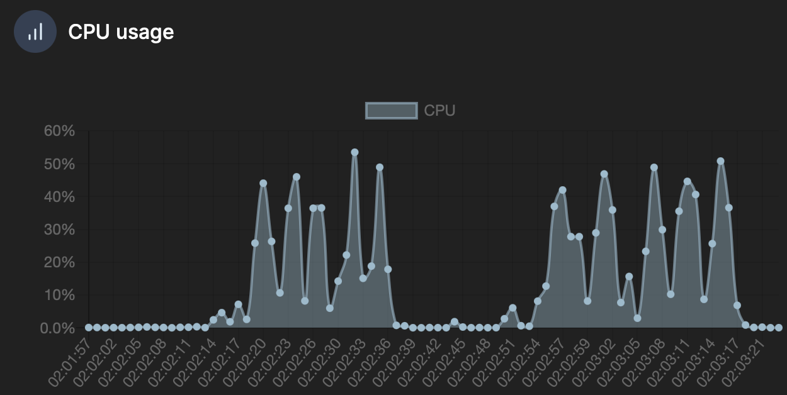

# 동시성 이슈 분석 리포트

## 동시성 문제 발생 가능한 부분

### 🙋‍♂️ ConcertSeat (좌석 점유)
- 상황 : 여러 사용자가 한 좌석에 동시에 점유 요청을 보내는 경우
- 문제 : 한 유저가 먼저 점유한 좌석을 다른 유저가 덮어쓸 수 있음
- 발생 빈도 : 매우 높음
- 중요도 : 매우 높음

### 📈 ConcertTimeslot (점유 좌석 수 계산)
- 상황 : 한 Timeslot 내의 여러 좌석 점유 요청이 동시에 발생하는 경우
- 문제 : 점유 좌석 증가 내역이 누락되어 총 갯수가 일치하지 않을 수 있음
- 발생 빈도 : 매우 높음
- 중요도 : 보통(오류가 나도 예약에 문제는 없음)

### 💰 Balance (사용자의 잔액 증가/차감)
- 상황 : 동시에 한 이용자의 잔액을 증가/차감하는 경우
- 문제 : 증가/차감 내역이 누락되어 잔액에 반영될 수 있음
- 발생 빈도 : 낮음
- 중요도 : 매우 높음(돈 관련)

## 동시성 문제 해결 방안 조사
### Optimistic Lock(낙관적 락)
- 방법 : Row에 Version을 명시하고, Row의 내용이 변경될 때마다 Version을 새로운 값으로 변경
- 충돌 발생 탐지 : 업데이트할 때의 Version값이 읽을 때의 Version값과 다르면 충돌 발생으로 판단
- 충돌 발생시 대처 : 실패로 귀결하거나 될 때까지 재시도
- 구현 복잡도 : 매우 낮음
  - JPA 이용하면 자동 처리 가능

### Pessimistic Lock(비관적 락)
- 방법 : Row별로 Lock을 걸고, 다른 트랜잭션의 접근을 차단
- 구현 복잡도 : 매우 낮음
  - Query에서 on update를 통해 걸 수 있으며, JPA 이용하면 자동 처리 가능
- 트랜잭션 격리 레벨
  - 읽기 정책에 따라 발생 가능한 문제
    - Dirty Read : commit되지 않은 값이 읽혀지는 현상
    - Non-Repeatable Read : 한 트랜잭션 내에서 두 번의 읽기 시, 다른 트랜잭션에 의해 값이 바뀌는 현상
    - Phantom Read : 한 트랜잭션 내에서 두 번의 읽기 시, 다른 트랜잭션에 의해 없던 데이터가 새로 생기는 현상 
  - Isolation Level에 따른 문제 해결책

  |                 	| DIRTY READ 	| NON-REPEATABLE READ 	| PHANTOM READ 	|
  |-----------------	|------------	|---------------------	|--------------	|
  | READ UNCOMMITED 	| O          	| O                   	| O            	|
  | READ COMMITED   	| X          	| O                   	| O            	|
  | REPEATABLE READ 	| X          	| X                   	| O            	|
  | SERIALIZABLE    	| X          	| X                   	| X            	|

### Distributed Lock(분산 락)
- 방법 : Redis 등을 이용해 공통 락을 이용
- 구현 복잡도 : 다소 높음
  - Query에서 on update를 통해 걸 수 있으며, JPA 이용하면 자동 처리 가능
- Java Redis 구현체 종류
  - Lettuce
    - Spin Lock 기반으로 동작
    - 무한루프 가능성을 포함해 고부하 문제점 있음
  - Redisson
    - Pub/Sub 기반으로 동작
    - 트래픽 부담 개선 및 타임아웃 등 기능 포함

### Message Queue
- 방법 : Kafka 등을 이용해 메세지 큐로 이벤트를 처리, 동시성 이슈를 원천 차단
- 구현 복잡도 : 매우 높음(별도 인프라 및 로직 필요, 실패시 복구 로직이 매우 복잡)

## 동시성 문제 해결 방안 장단점 비교
|           	| 장점                                                                        	| 단점                                                                                                     	 |
|-----------	|-----------------------------------------------------------------------------	|----------------------------------------------------------------------------------------------------------|
| 낙관적 락 	| 성능 향상 : 충돌이 적은 환경에서 성능이 좋다                                	| 재시도 필요 : 충돌시 재시도 필요하므로 오버헤드가 있을 수 있다                                           	                         |
| 비관적 락 	| 데이터 무결성 보장 : 충돌 가능성을 원천 차단 구현 간단 : 구현이 간단하다 	| 성능 저하 : DB에 부하가 가해지고, connection이 고갈될 수 있다 데드락 가능 : 잘못 관리하면 데드락 발생 	                                  |
| 분산락    	| 분산 환경 : 분산 환경에서도 락을 걸 수 있다                                 	| 관리 복잡 : 데드락, 롤백 로직 등을 직접 관리해야 한다                                                            	            |
| 메세지큐  	| 동시성 문제 회피 : 동시성 문제가 애초에 발생하지 않는다                     	| 시간 지연 : 데이터가 즉시 처리되지 않는다 인프라 필요 : kafka 등 시스템이 별도로 필요하다             	                                 |

## 동시성 문제별 해결책 선정
### ConcertSeat (좌석 점유)
- 해결책 : 낙관적 락
- 이유
  - 한 번 실패한 요청은 앞으로도 실패할 가능성이 높다
  - 낙관적 락의 단점인 재시도 부하가 사라지므로 성능상 이점이 가장 높을 것

### ConcertTimeslot (점유 좌석 수 계산)
- 해결책 : 비관적 락
- 이유
  - 충돌 빈도가 매우 잦음과 동시에, 재시도가 필수적이다
  - 낙관적 락을 적용한다면 재시도가 너무 많이 시도될 것이므로 성능상 오히려 안좋을 듯

### Balance (사용자의 잔액 증가/차감)
- 해결책 : 분산 락
- 이유
  - 사용자 잔액의 경우, 콘서트 외에도 여러 서비스에서 접근할 것으로 예상
  - 마이크로서비스 간 락을 필요로 할 수 있기에 분산락이 필요할 것

## 성능 테스트

- 시나리오 : 콘서트 예매시, 100명이 100개의 좌석을 두고 경쟁, 각 5회 반복
- 조작 변인 : ConcertTimeslotOccupancy(잔여석 갯수 카운트용 table) 접근의 비관적 락 or 낙관적 락
- 변인 통제
  - 기존 시나리오에서 ConcertSeat(콘서트 좌석 table) 점유는 낙관락이었으나,
  - `@Retry`에 의한 변인통제를 위해 이번 실험에서는 비관적 락 채택
- 측정 방법 : Portainer를 이용한 docker container statistics 분석(mariaDB)
- 그래프 설명
  - 그래프 좌측 : 비관락 5회
  - 그래프 우측 : 낙관락 5회
- 수치 
  - 비관락 : 5개평균 3.682s 
  - 낙관락 : 5개평균 4.913s
- 분석
  - 비관락과 낙관락의 cpu 점유율 최대치는 비슷해보임
  - 그러나 낙관락의 재시도 로직으로 인해 cpu 점유 시간이 더 길어지는 것을 확인
  - throughput 역시 비관락이 다소 높게 나옴
- 결론
  - 충돌로 인해 재시도 횟수가 많을 것 같은 table은 비관락이 유리할 것으로 판단됨
