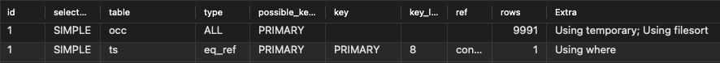
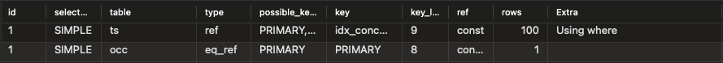

# 인덱스에 의한 쿼리 성능 개선
## 인덱싱 필요한 쿼리
### 콘서트 시간 조회 쿼리
ConcertTimeslot(콘서트 시간 Table) + ConcertTimeslotOccupancy(콘서트 시간별 잔여 좌석 수 Table)

콘서트별 시간 조회 + 정렬 + Join으로 인해 DB가 아파할 수 있다
```jpaql
SELECT new com.example.concert.concert.dto.ConcertTimeslotWithOccupancy(
    ts.id,
    ts.concertId,
    ts.concertStartTime,
    ts.reservationStartTime,
    occ.maxSeatAmount,
    occ.occupiedSeatAmount
)
FROM
    ConcertTimeslot ts
    INNER JOIN
    ConcertTimeslotOccupancy occ
ON
    ts.concertId=:concertId
    AND ts.id=occ.concertTimeslotId
ORDER BY
    ts.concertStartTime
```

## 인덱스 적용
`ConcertTimeslot`
```java
@Table(
        indexes = @Index(
                name = "idx_concert_id",
                columnList = "concertId, reservationStartTime"
        )
)
```

## 쿼리 성능 측정
### 더미데이터 축적
10000건의 콘서트 시간 정보 : 콘서트 100개 & 콘서트당 timeslot 100개를 삽입
```java
@Test
void insertDummyData() {
    for (int i = 0; i < 100; i++) {
        // Create Concert
        Concert concert = concertFacade.createConcert("콘서트 " + i);

        for (int j=0; j<100; j++) {
            LocalDateTime concertDateTime = LocalDateTime.now().plusDays(10 + j);
            concertFacade.createConcertTimeslot(
                    concert.getId(),
                    concertDateTime,
                    concertDateTime.minusDays(1)
            );
        }
    }
}
```

### 쿼리 적용 여부 확인
Query Execution Plan - type
쿼리가 실행될 방법을 표현
type 값을 통해 table이 join되는 방법과 index 활용 여부 판단 가능
- ALL 등 : Full scan으로 쿼리를 수행함
- ref, ref_or_null, eq_ref, range 등 : 쿼리 수행 시 index를 활용함

## 쿼리 성능 측정 결과
```sql
SELECT *
FROM
  concert.concert_timeslot ts
    INNER JOIN
  concert.concert_timeslot_occupancy occ
  ON
    ts.concert_id=7
    AND ts.id=occ.concert_timeslot_id
ORDER BY reservation_start_time;
```
- Query Execution Plan
  - 인덱스 적용 전 `0.0200s (10회 평균)`
  - 
  - 인덱스 적용 후 `0.0035s (10회 평균)`
  - 
