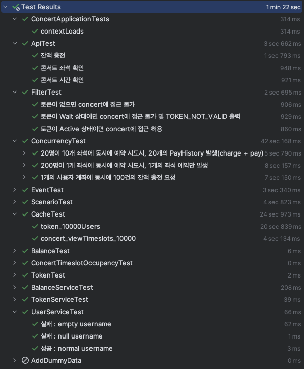

# 트랜잭션 관심사 분리

## AS-IS
### 설명
좌석 점유가 완료되면, 토큰을 Expire하는 로직
```java
public ConcertSeat occupyConcertSeat(Long seatId, Long userId, Optional<String> tokenString) {
    User user = userService.findByUserId(userId);

    ConcertSeat seat = concertService.findConcertSeat(seatId);
    seat.occupy(user.getId(), LocalDateTime.now());

    ConcertTimeslotOccupancy timeslotOccupancy = concertService.findConcertTimeslotOccupancy(seat.getConcertTimeslotId());
    timeslotOccupancy.increaseOccupiedSeatAmount();

    // 개선 전 코드
    tokenString.ifPresent(tokenService::expireToken);

    return seat;
}
```

### 문제점
- Token expire가 실패하면 좌석 예매가 롤백됨
  - 서브 로직이 메인 로직을 방해
- Concert 모듈에서 Token 모듈에 의존성 발생
  - Token 모듈 로직이 변경될 경우, 그것이 Concert 모듈까지 전파될 수 있음
  - 결합도 높음
- 향후 더 많은 서브로직이 추가된다면
  - 서브로직 코드가 많아져 메인로직의 가독성 저하

## TO-BE
Spring Event를 이용한 event 기반 처리

### 개선된 코드
#### [이벤트 발생](../src/main/java/com/example/concert/concert/ConcertFacade.java)
```java
public ConcertSeat occupyConcertSeat(Long seatId, Long userId, Optional<String> tokenString) {
    User user = userService.findByUserId(userId);

    ConcertSeat seat = concertService.findConcertSeat(seatId);
    seat.occupy(user.getId(), LocalDateTime.now());

    ConcertTimeslotOccupancy timeslotOccupancy = concertService.findConcertTimeslotOccupancy(seat.getConcertTimeslotId());
    timeslotOccupancy.increaseOccupiedSeatAmount();

    // 개선 후 코드
    eventPublisher.publishEvent(
            new ConcertSeatOccupyEvent(tokenString)
    );

    return seat;
}
```

#### [이벤트 객체](../src/main/java/com/example/concert/concert/event/ConcertSeatOccupyEvent.java)
```java
public record ConcertSeatOccupyEvent(
        Optional<String> tokenString
) {
}
```

#### [이벤트 리스너 in Token](../src/main/java/com/example/concert/token/TokenFacade.java)
```java
@Async
@TransactionalEventListener(phase = TransactionPhase.AFTER_COMMIT)
public void expireToken(ConcertSeatOccupyEvent concertSeatOccupyEvent) {
  concertSeatOccupyEvent
          .tokenString()
          .ifPresent(this.tokenService::expireToken);
}
```

#### [테스트](../src/test/java/com/example/concert/integration/EventTest.java)
```java
@Test
void tokenShouldExpire_afterConcertSeatOccupy() throws InterruptedException {
    // Given
    // 생략...

    // When
    concertFacade.occupyConcertSeat(
            concertSeat.getId(),
            userId,
            Optional.of(token.toString())
    );

    // Then
    Thread.sleep(1000);
    verify(tokenFacade, times(1))
            .expireToken(any(ConcertSeatOccupyEvent.class));
}
```

### 개선점
- 모듈간 의존도 완화
- 이벤트가 발생하는 객체는 그것이 어디까지 영향을 끼치는지 고려하지 않아도 됨

### 이벤트 테스트
- 이벤트가 잘 전파되는지 테스트
- 테스트 방법
  1. 이벤트가 발생하는 함수 실행
  2. 이벤트 리스너를 Spy로 생성하고, 리스너 함수 실행여부를 확인
- Async로 인한 비동기 실행은 `Thread.sleep()`으로 기다린 다음 확인
- 전체 테스트 수행 결과


## 그 외 알아본 것들
#### repository.saveAndFlush
- save와 즉시에 query 수행
- transaction이 즉시 commit되므로, phase=AFTER_COMMIT 이벤트가 즉시 수행

#### Domain Event vs Application Event
- ApplicationEventPublisher
  - application에서 명시적으로 event를 publish하면 trigger됨
- Domain Event
  - AggregateRoot Entity가 save될 경우, 자동으로 이벤트 발행

## 앞으로 공부해야 할 것
- MSA 적용을 위한
  - 마이크로서비스 분리
    - Database per Service 패턴
    - 전체 로직을 한 트랜잭션만으로 수행하지 못 할 수 있음
  - 보상 트랜잭션
    - Transaction을 이용하지 못하는 상태에서, 특정 로직 실패시 rollback을 어떻게 시킬 것인가? 
    - Saga 패턴, transactional outbox 패턴, 서킷브레이커 패턴 등..
    - 용어만 들어봤고 공부는 과제 제출 이후에 해볼 예정..
