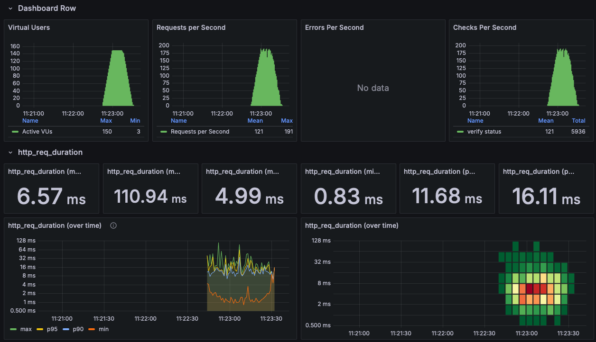
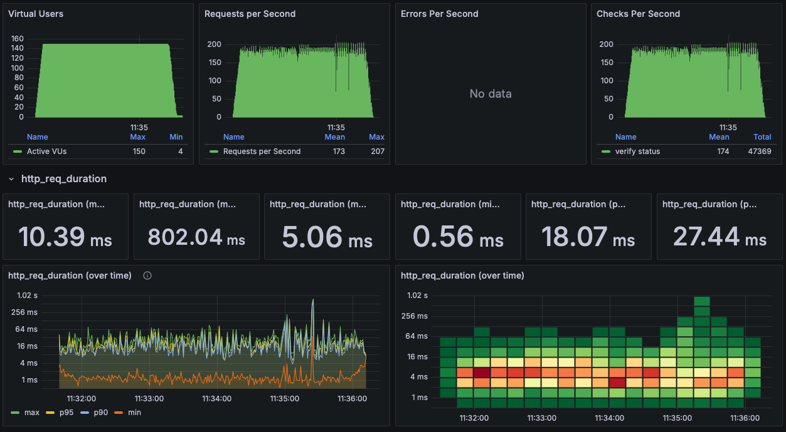
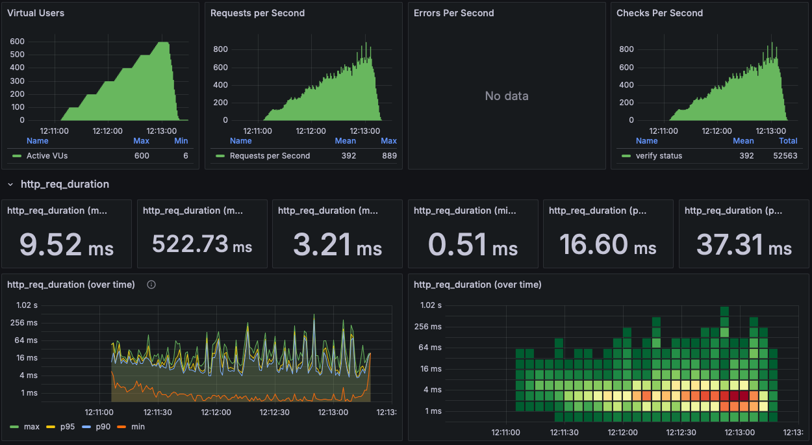
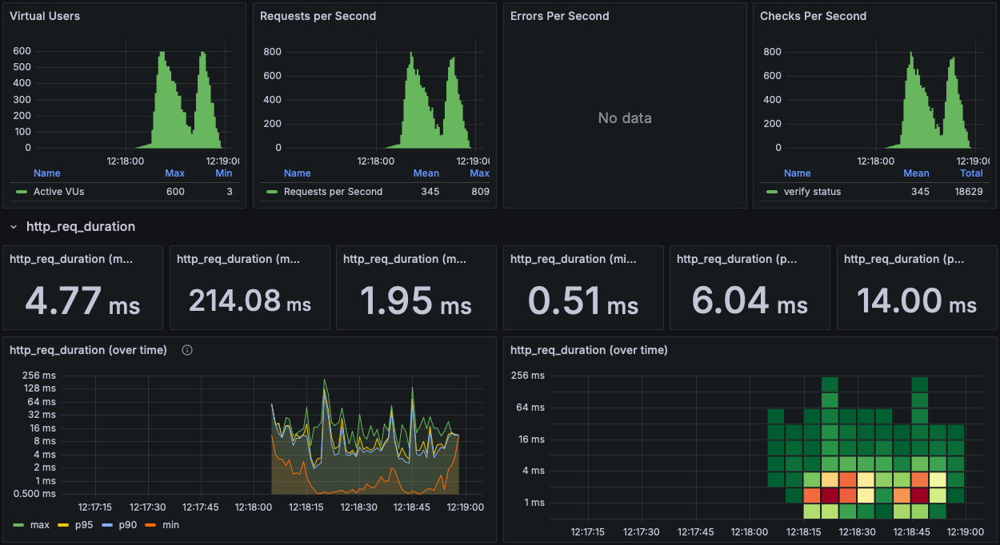

# 부하 테스트

## 대상 선정
### 시나리오
- 콘서트 시나리오 자체가 대규모 트래픽을 염두에 두었음
- 대기열 시스템을 통해 최대 부하 제어가 가능한 상태
- 따라서 성능테스트에서는 초당 토큰 허용을 *무제한(100000)* 으로 변경해서 진행
  ```java
  @Scheduled(fixedDelay = 1000)
  private void tokenScheduler() {
      tokenFacade.refreshTokenQueue(100000);
      log.info("Token refreshed");
  }
  ```
- vuser는 아래의 순서대로 작업을 수행
  - 회원가입
  - 토큰 발급
  - 콘서트 조회
  - 잔여석 조회
  - 좌석 점유
  - 결제
- 추가적으로, 인스턴스를 조정하며 최대 부하량과 병목 지점을 탐색

### 구성요소
- API 서버(Spring)
- Redis 서버
- Kafka 서버

## 목적
콘서트 예매 시스템의 대규모 트래픽 대응 능력 평가
- 대기열 시스템을 통해 db 접근이 잘 제어되고 있는가
- 클라이언트 응답시간이 일관적으로 유지되고 있는가
- 대기열 시스템의 초당 activate 횟수 적정값 확인

## 수행 방법
### 툴
K6, influxDB, Grafana

### [스크립트](../k6/script.js)
```text
회원가입
토큰 발급
while true {
    if 토큰상태 확인 == ACTIVE {
        break;
    }
}
콘서트 조회
잔여석 조회
좌석 점유
결제
```

## 수행 결과
### Load Test
#### Stage
```text
    stages: [
        { duration: '15s', target: 150 },
        { duration: '15s', target: 150 },
        { duration: '15s', target: 0 },
    ],
```
#### 결과

```text
2024-11-28 11:23:33      ✓ verify status
2024-11-28 11:23:33 
2024-11-28 11:23:33      checks.........................: 100.00% 5953 out of 5953
2024-11-28 11:23:33      data_received..................: 1.2 MB  25 kB/s
2024-11-28 11:23:33      data_sent......................: 1.1 MB  23 kB/s
2024-11-28 11:23:33      http_req_blocked...............: avg=56.78µs  min=791ns    med=4.58µs  max=23.08ms  p(90)=14.83µs  p(95)=29.64µs 
2024-11-28 11:23:33      http_req_connecting............: avg=44.02µs  min=0s       med=0s      max=22.49ms  p(90)=0s       p(95)=0s      
2024-11-28 11:23:33    ✓ http_req_duration..............: avg=6.56ms   min=827.75µs med=4.97ms  max=110.93ms p(90)=11.68ms  p(95)=16.07ms 
2024-11-28 11:23:33        { expected_response:true }...: avg=6.56ms   min=827.75µs med=4.97ms  max=110.93ms p(90)=11.68ms  p(95)=16.07ms 
2024-11-28 11:23:33      http_req_failed................: 0.00%   0 out of 5953
2024-11-28 11:23:33      http_req_receiving.............: avg=126.39µs min=6.7µs    med=50.45µs max=12.58ms  p(90)=232.46µs p(95)=358.49µs
2024-11-28 11:23:33      http_req_sending...............: avg=33.08µs  min=2.58µs   med=15.79µs max=4.56ms   p(90)=56.73µs  p(95)=89.05µs 
2024-11-28 11:23:33      http_req_tls_handshaking.......: avg=0s       min=0s       med=0s      max=0s       p(90)=0s       p(95)=0s      
2024-11-28 11:23:33      http_req_waiting...............: avg=6.4ms    min=748.16µs med=4.84ms  max=110.92ms p(90)=11.38ms  p(95)=15.37ms 
2024-11-28 11:23:33      http_reqs......................: 5953    122.162146/s
2024-11-28 11:23:33      iteration_duration.............: avg=4.04s    min=4.01s    med=4.03s   max=5.08s    p(90)=4.06s    p(95)=4.07s   
2024-11-28 11:23:33      iterations.....................: 1189    24.399595/s
2024-11-28 11:23:33      vus............................: 3       min=3            max=150
2024-11-28 11:23:33      vus_max........................: 150     min=150          max=150
2024-11-28 11:23:33 
2024-11-28 11:23:33 
2024-11-28 11:23:33 running (0m48.7s), 000/150 VUs, 1189 complete and 0 interrupted iterations
2024-11-28 11:23:33 default ✓ [ 100% ] 000/150 VUs  45s
```
- 문제 없이 실행되지만, 끝으로 갈수록 min duration이 증가하는 모습을 보였다.
- 추가 테스트가 필요해보인다.

### Endurance Test
#### Stage
```text
    stages: [
        { duration: '15s', target: 150 },
        { duration: '4m', target: 150 },
        { duration: '15s', target: 0 },
    ],
```
#### 결과

```text
2024-11-28 11:36:26      ✓ verify status
2024-11-28 11:36:26 
2024-11-28 11:36:26      checks.........................: 100.00% 47473 out of 47473
2024-11-28 11:36:26      data_received..................: 9.9 MB  34 kB/s
2024-11-28 11:36:26      data_sent......................: 9.1 MB  32 kB/s
2024-11-28 11:36:26      http_req_blocked...............: avg=29.46µs  min=667ns    med=3.58µs  max=36.66ms  p(90)=13.29µs  p(95)=23.75µs 
2024-11-28 11:36:26      http_req_connecting............: avg=18.04µs  min=0s       med=0s      max=36.62ms  p(90)=0s       p(95)=0s      
2024-11-28 11:36:26    ✓ http_req_duration..............: avg=10.37ms  min=561.79µs med=5.05ms  max=802.04ms p(90)=18.07ms  p(95)=27.44ms 
2024-11-28 11:36:26        { expected_response:true }...: avg=10.37ms  min=561.79µs med=5.05ms  max=802.04ms p(90)=18.07ms  p(95)=27.44ms 
2024-11-28 11:36:26      http_req_failed................: 0.00%   0 out of 47473
2024-11-28 11:36:26      http_req_receiving.............: avg=194.77µs min=4.91µs   med=41.87µs max=213.19ms p(90)=234.75µs p(95)=370.82µs
2024-11-28 11:36:26      http_req_sending...............: avg=33.19µs  min=2µs      med=12.45µs max=21.32ms  p(90)=46.66µs  p(95)=81.55µs 
2024-11-28 11:36:26      http_req_tls_handshaking.......: avg=0s       min=0s       med=0s      max=0s       p(90)=0s       p(95)=0s      
2024-11-28 11:36:26      http_req_waiting...............: avg=10.15ms  min=538.79µs med=4.92ms  max=801.8ms  p(90)=17.7ms   p(95)=27.09ms 
2024-11-28 11:36:26      http_reqs......................: 47473   165.632751/s
2024-11-28 11:36:26      iteration_duration.............: avg=4.07s    min=4s       med=4.04s   max=5.71s    p(90)=4.09s    p(95)=4.14s   
2024-11-28 11:36:26      iterations.....................: 9461    33.00932/s
2024-11-28 11:36:26      vus............................: 3       min=3              max=150
2024-11-28 11:36:26      vus_max........................: 150     min=150            max=150
2024-11-28 11:36:26 
2024-11-28 11:36:26 
2024-11-28 11:36:26 running (4m46.6s), 000/150 VUs, 9461 complete and 4 interrupted iterations
2024-11-28 11:36:26 default ✓ [ 100% ] 000/150 VUs  4m30s
```
- p90이 700ms로 튀는 현상 발생 

### Stress Test
#### Stage
```text
    stages: [
        { duration: '10s', target: 100 },
        { duration: '10s', target: 100 },
        { duration: '10s', target: 200 },
        { duration: '10s', target: 200 },
        { duration: '10s', target: 300 },
        { duration: '10s', target: 300 },
        { duration: '10s', target: 400 },
        { duration: '10s', target: 400 },
        { duration: '10s', target: 500 },
        { duration: '10s', target: 500 },
        { duration: '10s', target: 600 },
        { duration: '10s', target: 600 },
        { duration: '10s', target: 0 },
    ],
```
#### 결과

```text
dial i/o timeout

2024-11-28 12:13:35      ✗ verify status
2024-11-28 12:13:35       ↳  99% — ✓ 52624 / ✗ 11
2024-11-28 12:13:35 
2024-11-28 12:13:35      checks.........................: 99.97% 52624 out of 52635
2024-11-28 12:13:35      data_received..................: 11 MB  73 kB/s
2024-11-28 12:13:35      data_sent......................: 10 MB  68 kB/s
2024-11-28 12:13:35      http_req_blocked...............: avg=2.26ms  min=0s       med=2.62µs  max=19.72s   p(90)=12.83µs p(95)=24.62µs 
2024-11-28 12:13:35      http_req_connecting............: avg=2.25ms  min=0s       med=0s      max=19.72s   p(90)=0s      p(95)=0s      
2024-11-28 12:13:35    ✓ http_req_duration..............: avg=9.52ms  min=0s       med=3.2ms   max=522.73ms p(90)=16.6ms  p(95)=37.3ms  
2024-11-28 12:13:35        { expected_response:true }...: avg=9.52ms  min=513.95µs med=3.2ms   max=522.73ms p(90)=16.61ms p(95)=37.3ms  
2024-11-28 12:13:35      http_req_failed................: 0.02%  11 out of 52635
2024-11-28 12:13:35      http_req_receiving.............: avg=91.76µs min=0s       med=28.54µs max=45.98ms  p(90)=164.2µs p(95)=255.76µs
2024-11-28 12:13:35      http_req_sending...............: avg=31.64µs min=0s       med=10.25µs max=21.76ms  p(90)=40.6µs  p(95)=72.55µs 
2024-11-28 12:13:35      http_req_tls_handshaking.......: avg=0s      min=0s       med=0s      max=0s       p(90)=0s      p(95)=0s      
2024-11-28 12:13:35      http_req_waiting...............: avg=9.4ms   min=0s       med=3.11ms  max=522.64ms p(90)=16.34ms p(95)=37.07ms 
2024-11-28 12:13:35      http_reqs......................: 52635  352.425484/s
2024-11-28 12:13:35      iteration_duration.............: avg=4.17s   min=4s       med=4.03s   max=34.02s   p(90)=4.26s   p(95)=5.03s   
2024-11-28 12:13:35      iterations.....................: 10365  69.400402/s
2024-11-28 12:13:35      vus............................: 1      min=1              max=600
2024-11-28 12:13:35      vus_max........................: 600    min=600            max=600
2024-11-28 12:13:35 
2024-11-28 12:13:35 
2024-11-28 12:13:35 running (2m29.4s), 000/600 VUs, 10365 complete and 0 interrupted iterations
2024-11-28 12:13:35 default ✓ [ 100% ] 000/600 VUs  2m10s
```
- vuser 600부터 dial i/o timeout이 발생하기 시작
- 에러를 제외한 duration은 안정적인 것을 확인

### Peak Test
#### Stage
```text
    stages: [
        { duration: '10s', target: 30 },
        { duration: '5s', target: 600 },
        { duration: '20s', target: 30 },
        { duration: '5s', target: 600 },
        { duration: '10s', target: 0 },
    ],
```
#### 결과

```text
2024-11-28 12:18:59      ✓ verify status
2024-11-28 12:18:59 
2024-11-28 12:18:59      checks.........................: 100.00% 18644 out of 18644
2024-11-28 12:18:59      data_received..................: 3.9 MB  72 kB/s
2024-11-28 12:18:59      data_sent......................: 3.6 MB  67 kB/s
2024-11-28 12:18:59      http_req_blocked...............: avg=32.24µs min=708ns    med=2.12µs  max=18.36ms  p(90)=10.61µs p(95)=26.74µs 
2024-11-28 12:18:59      http_req_connecting............: avg=23.75µs min=0s       med=0s      max=18.3ms   p(90)=0s      p(95)=0s      
2024-11-28 12:18:59    ✓ http_req_duration..............: avg=4.77ms  min=509.95µs med=1.94ms  max=214.08ms p(90)=6.05ms  p(95)=14.01ms 
2024-11-28 12:18:59        { expected_response:true }...: avg=4.77ms  min=509.95µs med=1.94ms  max=214.08ms p(90)=6.05ms  p(95)=14.01ms 
2024-11-28 12:18:59      http_req_failed................: 0.00%   0 out of 18644
2024-11-28 12:18:59      http_req_receiving.............: avg=83.55µs min=4.91µs   med=24.54µs max=20.35ms  p(90)=131.5µs p(95)=196.54µs
2024-11-28 12:18:59      http_req_sending...............: avg=19.16µs min=1.95µs   med=8.95µs  max=7.61ms   p(90)=27.57µs p(95)=45.33µs 
2024-11-28 12:18:59      http_req_tls_handshaking.......: avg=0s      min=0s       med=0s      max=0s       p(90)=0s      p(95)=0s      
2024-11-28 12:18:59      http_req_waiting...............: avg=4.66ms  min=473.04µs med=1.88ms  max=214.01ms p(90)=5.86ms  p(95)=13.67ms 
2024-11-28 12:18:59      http_reqs......................: 18644   347.195976/s
2024-11-28 12:18:59      iteration_duration.............: avg=4.06s   min=4s       med=4.01s   max=5.24s    p(90)=4.07s   p(95)=4.14s   
2024-11-28 12:18:59      iterations.....................: 3704    68.97736/s
2024-11-28 12:18:59      vus............................: 7       min=3              max=600
2024-11-28 12:18:59      vus_max........................: 600     min=600            max=600
2024-11-28 12:18:59 
2024-11-28 12:18:59 
2024-11-28 12:18:59 running (0m53.7s), 000/600 VUs, 3704 complete and 0 interrupted iterations
2024-11-28 12:18:59 default ✓ [ 100% ] 000/600 VUs  50s
```
- 순간 vuser가 600이어도 서버가 소화하는 것을 확인

## 작업중 겪은 문제
### Spring Boot Application 도커로 배포
- Docker Compose 활용
- Docker network 이용하기 위한 spring profile 생성

### Kafka Listener 설정 문제
- docker network를 통해 application-kafka 연결
- 주소 연결 과정에서 아래 에러 발견
  ```text
  java.lang.IllegalArgumentException: Error creating broker listeners from 'INTERNAL://0.0.0.0:29092,EXTERNAL://0.0.0.0:9092': No security protocol defined for listener INTERNAL
  ```
- Kafka 주소 설정 관련 찾아보다가 KAFKA_LISTENER와 KAFKA_ADVERTISED_LISTENERS 설정 발견
- KAFKA_LISTENER : Kafka 브로커가 실제로 수신(listen)할 네트워크 주소와 포트를 정의
- KAFKA_ADVERTISED_LISTENER : Kafka 브로커가 클라이언트나 다른 브로커들에게 광고(advertise)할 주소를 정의
- 기본값인 localhost:9092를 kafka:9092로 변경하여 해결

### `read: connection reset by peer`문제
- 원인
  - Mac OS에서 k6 vuser를 100 이상으로 증가시켰을 때 발생
  - 서버에서는 에러메세지가 발생하지 않지만, 클라이언트에서만 발생
- 해결
  - 처음에는 application 문제인 줄 알았으나, 네트워크 문제라는 실마리를 발견
  - 도커를 통해 k6를 리눅스 환경에서 띄우자 문제가 사라짐
  - 슬랙 아고라에 문제 상황 공유

### MacOS host 접근 문제
- 원인
  - MacOS의 docker는 linux와 다르게 docker desktop 환경에서 구동
  - 컨테이너의 네트워크가 host mode일지라도 localhost에 접근할 수 없는 문제 발생
- 해결
  - localhost 주소를 host.docker.internal로 변경하여 해결

