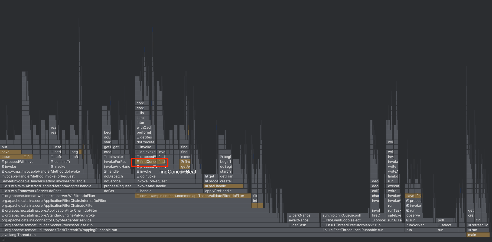
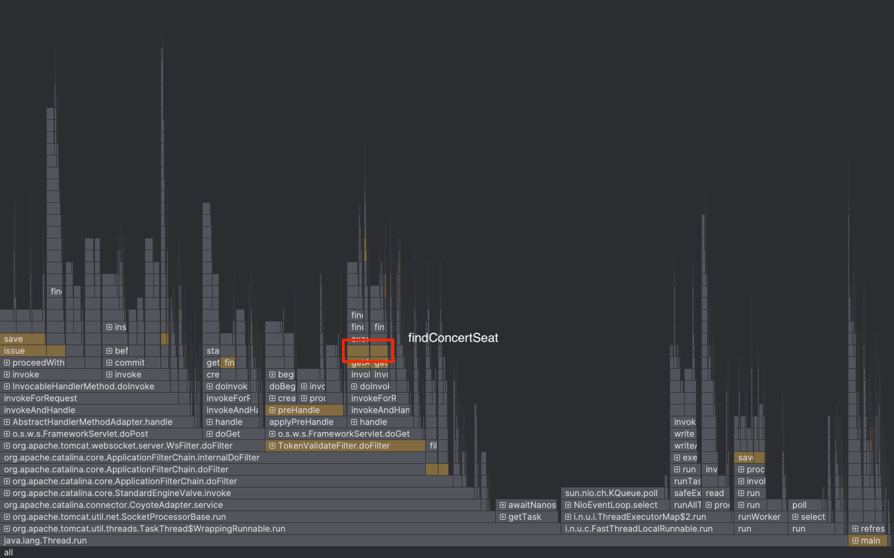
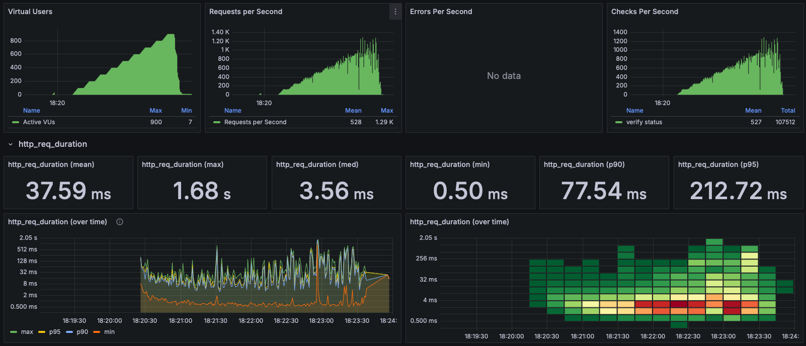
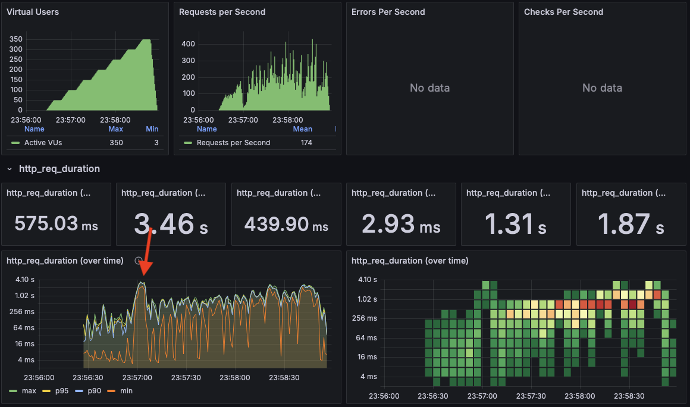

# 장애 대응 문서

## 원인 파악 방법
### Intellij Profiling
- Server Application의 어떤 코드에서 지연이 발생하는지 파악 가능

## 대응
### 장애 포인트
- 부하테스트에서 실질적인 장애는 발생하지 않았지만, 가상 시나리오로 장애상황을 가정
- `findConcertSeats` 함수의 부하로 인해 장애가 발생했다고 가정

### 최초 탐지(가정)
- 모니터링 툴을 통해 p90이 일정시간 이상으로 올라간 것을 탐지
- Slack 알람을 통해 담당자에게 전파

### 장애 분석

- Intellij Profiling을 통해 문제 코드를 파악
- findConcertSeats 함수의 슬로우 쿼리가 원인
- 부하테스트 실행 시, 5000ms대 부하가 걸리는 것을 확인
- 장애 등급 : DAU 기준, Medium High등급으로 판단

### 장애 조치
- 콘서트 예매 팀에 해당 내용 전파
- 장애 지점인 `findConcertSeats`에 캐싱 적용
```java
@Cacheable(value = "concert:timeslot:seat", key = "#timeslotId", cacheManager = "redisCacheManager")
public List<ConcertSeat> findConcertSeats(Long timeslotId) { ... }
```
- 고객 대응 팀에 조치 완료 전파 및 공지 게시 요청

### 조치 결과

- 장애 지점에 걸렸던 부하가 5000ms대 -> 319ms로 90% 이상 감소

### 조치 후 성능 테스트

- vuser 800부터 connection timeout 에러가 발생
- Step 19에서 테스트했던 vuser 600보다 **_30%_** 성능 향상 

# 기타 알아본 자료들
### 참고자료
- [배민 장애대응](https://techblog.woowahan.com/4886/)

### 장애 전파 기능
- APM을 이용 가능
- Scouter, Pinpoint, Prometheus&Grafana 등
- Prometheus
  - Alert 기능 제공
  - ```yaml
    groups:
    - name: example
      labels:
      team: myteam
      rules:
        - alert: HighRequestLatency
          expr: job:request_latency_seconds:mean5m{job="myjob"} > 0.5
          for: 10m
          keep_firing_for: 5m
          labels:
          severity: page
          annotations:
          summary: High request latency
    ```
  - ```yaml
    receivers:
    - name: 'email-notifications'
      email_configs:
      - to: 'your-email@example.com'
        from: 'alertmanager@example.com'
        smarthost: 'smtp.gmail.com:587'
        auth_username: 'your-gmail-username@gmail.com'
        auth_identity: 'your-gmail-username@gmail.com'
        auth_password: 'your-gmail-password'
        ```

# 부록
- 흔히 생각하는 장애는 일정 트래픽이 넘어가는 순간 급격히 발생
- 이는 보통 db 락과 같은 병목에 의해 발생
- 그런데, 콘서트 예제는 시나리오 대부분이 db read이므로 해당 문제를 접하지 못함
- 따라서 코치님 조언을 얻어 실험용 api를 제작해서 문제를 재현해보기로 함

### 테스트용 코드
- DB pessimistic lock을 이용
- 정말 테스트만을 위해서, 레이어&아키텍처&클린코드 신경쓰지 않고 컨트롤러 함수 하나로 임시 구현
  - TestAPITable : Entity
  - TestAPIRepository : Repository
- row 생성시 동시성 문제가 있기는 하지만, 실험중 문제는 없기 때문에 부하 테스트에만 집중
- Connection pool은 max 200으로 상향

```java
    @Transactional
    @PostMapping("")
    public Long increase() {
        if (testAPIRepository.count() == 0) {
            TestAPITable table = TestAPITable.builder().count(0L).build();
            testAPIRepository.save(table);
        }
        TestAPITable table = testAPIRepository.findTopByOrderByIdAsc();
        table.increaseCount();
        return table.getCount();
    }
```

### 결과

- 드디어 vuser 100부터 응답시간이 급증하는 현상을 발견
- 해당 인스턴스의 최대 부하는 vuser 100이라고 해석 가능할 것 같다
